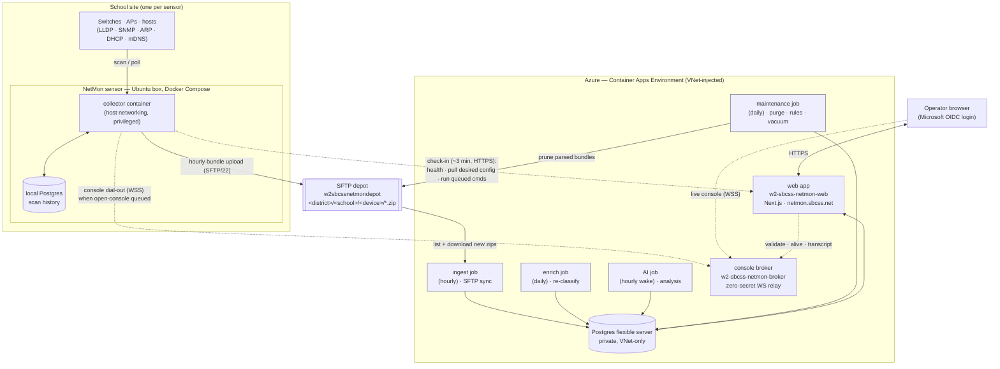
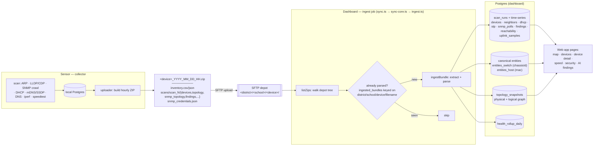

# NetMon architecture

How the whole system fits together: the **sensor** ([`net_mon`](https://github.com/adoty-sbcss/net_mon),
a separate repo), the **SFTP depot** it ships data to, and this **dashboard**
(`netmon-dashboard`, an Azure-hosted Next.js app) that ingests, analyzes, and
displays it.

The diagrams below are [Mermaid](https://mermaid.js.org/) — GitHub renders them
inline, and Lucid / draw.io / Mermaid Live import the same fenced text if you
want an editable canvas. Keep them in sync with the code when the shape of the
system changes; this file is the map people read first.

Related docs in this repo:
- [DESIGN.md](./DESIGN.md) — dashboard design notes.
- [DEPLOY.md](./DEPLOY.md) — how the dashboard builds, migrates, and rolls.
- [device-classification.md](./device-classification.md) — how devices are typed.

Sensor-side contracts (the public `net_mon` repo):
- [README](https://github.com/adoty-sbcss/net_mon/blob/main/README.md) — operating a sensor day-to-day.
- [CONFIG.md](https://github.com/adoty-sbcss/net_mon/blob/main/CONFIG.md) — every `NETMON_*` knob and the file layout.
- [HARDENING.md](https://github.com/adoty-sbcss/net_mon/blob/main/docs/HARDENING.md) — what a sensor host hardens and deliberately doesn't.

---

## 1. System architecture (end to end)

One sensor per site scans its networks and ships hourly evidence bundles to a
per-district SFTP depot. The dashboard pulls those bundles, builds canonical
inventory + topology + findings, and serves the operator UI. A separate
**control plane** (outbound check-in) lets the dashboard push config and queue
commands without ever opening an inbound port on the box.



**Key properties**

- **The box never accepts inbound connections.** All dashboard→sensor control
  is the sensor *polling out* on its check-in timer (see `checkin.py`). Config
  pushes and queued commands are picked up on the next check-in (~3 min).
- **Bundles are the only bulk data path.** Scans → local Postgres → hourly ZIP →
  SFTP → ingest. Live POSTs (speedtest / latency results, check-in health) are a
  thin side channel, not the inventory pipeline.
- **Postgres is private.** The web app and every job sit in the VNet and reach
  the flexible server over private DNS; there is no public DB endpoint.
- **The broker holds no secrets and no DB.** It's a stateless WebSocket relay;
  every authorization decision is made by the web app (see §4).

---

## 2. Bundle data flow (scan → SFTP → dashboard tables)

What's inside an hourly ZIP and how the ingest job turns it into rows. The
dedup ledger (`ingested_bundles`) is keyed on the **full tenancy path**, not the
bare filename — that's the [ING-1] fix that stopped same-named `mdf_*.zip`
bundles from different districts colliding.



**Notes**

- `ingestBundle()` resolves tenancy (district→school→sensor), writes per-scan
  time-series, then folds the scan into **canonical entities** (dedup switches on
  `chassisId`, hosts on `mac`) and **union-merges** the topology snapshot so the
  map heals incrementally on each bundle.
- Re-ingest is idempotent; `--force` clears prior time-series for the bundle and
  rebuilds. The maintenance job later prunes parsed bundles off SFTP after a
  grace period but keeps the ledger rows.

---

## 3. Provisioning & enrollment

How a fresh Ubuntu box becomes an enrolled sensor with no token copy-paste. The
dashboard's deploy page bakes the shared bootstrap key + the district's scoped
SFTP creds into `provisioning.env`; the box **self-enrolls** on its first
check-in and is issued its own per-sensor token.

```mermaid
sequenceDiagram
    autonumber
    actor Tech as Technician
    participant Dash as Dashboard web app
    participant Box as Sensor box
    participant Depot as SFTP depot
    participant GHCR as GHCR collector image

    Tech->>Dash: open School → "Deploy a sensor here" (superadmin)
    Dash-->>Tech: provisioning.env (dashboard URL + bootstrap key<br/>+ scoped SFTP creds + district/school/device slugs)<br/>+ git clone & install.sh commands
    Note over Dash,Depot: per-district SFTP user is minted on district create<br/>(scoped, chroot'd home) — SFTP-2

    Tech->>Box: git clone net_mon; drop provisioning.env; sudo ./install.sh
    Box->>GHCR: docker pull netmon-collector:stable (build fallback if blocked)
    Box->>Box: wizard pre-fills URL+key; create /etc/netmon + /var/lib/netmon

    Box->>Dash: first check-in — present bootstrap key + identity
    Dash->>Dash: validate key; create/get district→school→sensor
    Dash-->>Box: issue per-sensor enrollment token
    Box->>Box: persist token to /var/lib/netmon/enroll-token
    Note over Dash: sensor now appears under "Sensors"

    loop every hour
        Box->>Depot: upload &lt;device&gt;_*.zip
    end
    loop nightly ~03:00
        Box->>GHCR: auto-update: pull current channel image, healthcheck, auto-rollback
    end
```

**Notes**

- The **bootstrap key is shared and the repo is public**, so `provisioning.env`
  is git-ignored and distributed out-of-band; rotate it from the dashboard if it
  leaks. The per-sensor token issued at enrollment is the box's real credential.
- New installs ship with sensible defaults **on** (SNMP, spine crawl, speed
  tests, SFTP upload) so data flows without extra steps.
- Field boxes **pull a prebuilt image from GHCR** (REL-3) rather than building
  locally; `build:` stays as an egress-filtered-network fallback.

---

## 4. Remote console & command broker

How an operator gets a live shell/diagnostic session to a box that accepts no
inbound connections. The dashboard mints two one-time tokens and queues an
`open-console` command; the broker is a **zero-secret relay** that pairs the two
WebSockets and asks the dashboard for every authorization decision. Commands are
allow-listed at **both** the broker and the sensor.

```mermaid
sequenceDiagram
    autonumber
    actor Op as Operator · superadmin
    participant Web as Dashboard web app
    participant Broker as Broker · zero-secret WS relay
    participant Box as Sensor · collector

    Op->>Web: Open console (sensor page)
    Web->>Web: mint operator + sensor tokens (hashes stored)<br/>create shell_sessions row · time-box (TTL 30m, cap 60m)
    Web->>Box: queue "open-console" command (delivered on check-in)

    Op->>Broker: WSS /console?role=operator&token=…&sid=…
    Broker->>Web: POST /api/broker/validate (operator)
    Web-->>Broker: ok {sid, sensorId, expiresAt, recordKey}
    Broker-->>Op: hello → "waiting for sensor"

    Note over Box: next check-in / fast console-poll (≤30s) picks up open-console
    Box->>Broker: WSS /console?role=sensor&token=…&sid=…
    Broker->>Web: POST /api/broker/validate (sensor) → status pending→active
    Broker-->>Op: ready {expiresAt}
    Broker-->>Box: ready {expiresAt}

    loop interactive session
        Op->>Broker: {cmd, id}
        Broker->>Broker: allow-list check (ALLOWED_CMDS)
        Broker->>Box: forward if allowed (else reject + record)
        Box->>Box: enforce its own allow-list (diag · control · live-ops)
        Box-->>Broker: stream stdout/exit
        Broker-->>Op: relay verbatim
    end

    par lifecycle (broker ↔ web app)
        Broker->>Web: GET /api/broker/alive?sid (every ~10s)
        Web-->>Broker: alive, expiresAt? — kill or extend (+15m, CON-6)
    and
        Broker->>Web: POST /api/broker/transcript (every ~30s)
        Web->>Web: append frames to shell_sessions.transcript
    end

    Note over Broker,Box: idle 2m or time-box reached → broker closes both ends
```

**Notes**

- **Why a broker at all:** the box dials *out* to the broker (WSS/443-friendly),
  so no inbound port and no port-forwarding at the site. The broker stores no
  secrets and no DB — it relays bytes and defers every decision to the web app.
- **Defense in depth on commands:** the broker enforces `ALLOWED_CMDS`; the
  sensor independently enforces its own allow-lists (read-only `diag-*`,
  state-changing `ctl-*`, and live in-container ops). Host-level actions
  (restart / rebuild / rollback / reboot) take a separate queued path via a
  host wrapper, not the live session.
- **Bounded by design:** sessions are super-admin-only, type-to-confirm on
  state-changing actions, fully transcript-recorded, and hard-killed at the
  time-box. See the `CON-*` features for the security-review trail.

---

## Where this lives in code

| Concern | Sensor (`net_mon`) | Dashboard (`netmon-dashboard`) |
|---|---|---|
| Scan / poll | `collector/src/collector/{scan,poller,discovery}` | — |
| Bundle build + upload | `bundle.py`, `uploader.py` | — |
| SFTP ingest | — | `src/ingest/{sync,sync-core,ingest,bundle}.ts` |
| Background jobs | — | `src/jobs/maintenance.ts`, `src/ingest/enrich.ts`, `src/ai/run.ts` |
| AI analysis + issues | — | `src/lib/ai/*`, `src/lib/issues/reconcile.ts` |
| Control plane (check-in) | `checkin.py` | `src/app/api/sensor/*` |
| Remote console | `remote_console.py`, `checkin.py` | `broker/index.js`, `src/app/api/broker/*` |
| Infra (Azure) | — | `infra/main.bicep`, `infra/broker.bicep` |

> Diagrams are intentionally high-level. For exact tables, OIDs, and migration
> history, read the code referenced above — it's the source of truth this file
> summarizes.
